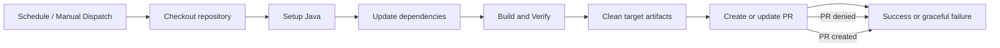

# Nightly Dependency Update Lessons Learned

## Overview

This document captures the investigation, diagnosis, and remediation of the nightly Maven dependency update workflow in `enterprise-command-center`.

The root problem was not the Maven dependency update itself, but the GitHub Actions automation around branch/pull-request creation and generated build artifacts.

---

## What happened

1. The nightly workflow successfully updated dependencies and rebuilt the project.
2. The `peter-evans/create-pull-request@v6` step attempted to create or update a PR.
3. The workflow failed when GitHub Actions was not permitted to create or approve pull requests.
4. The action also discovered generated `target/` build artifacts in the automated branch.
5. An early workflow version contained an unsupported `if:` expression using `secrets` during manual dispatch.

---

## Key findings

### 1. GitHub Actions PR creation permissions are the critical blocker

- The workflow run reached the PR step successfully.
- The logs showed the branch push completed, but PR creation failed with:
  - `GitHub Actions is not permitted to create or approve pull requests.`
- This is a repository or organization policy / permission issue, not a Maven failure.

### 2. Build artifacts were being added to the automated branch

- The action committed files under `target/`, including:
  - `target/rest-api-aggregator-1.0.0-SNAPSHOT.jar`
  - `target/classes/...`
  - `target/maven-status/...`
- That caused another class of failure and a large file warning from GitHub.
- A reliable automated dependency workflow must remove generated artifacts before committing.

### 3. The workflow used an unsupported conditional expression early in the process

- The original step had `if: ${{ secrets.PERSONAL_ACCESS_TOKEN != '' }}`.
- This triggered a workflow parse error when manually dispatching with `gh workflow run`.
- The design was changed to avoid GitHub expression parsing issues and allow a fallback token.

### 4. The branch name and PR flow needed to be robust

- The workflow uses `branch: "automated/maven-dependency-updates"`.
- The action now falls back cleanly when PR creation is blocked and does not block the whole job.

---

## Fixes applied

### Workflow updates

The file `.github/workflows/nightly-dependency-update.yml` was updated with:

- `permissions:` block to request `contents: write` and `pull-requests: write`
- safer Maven version update flags
- a cleanup step before PR creation:
  - `git rm -r --cached target || true`
- `create-pull-request` configured with:
  - fallback token: `${{ secrets.PERSONAL_ACCESS_TOKEN || github.token }}`
  - `continue-on-error: true`

### Branch and repository hygiene

- Verified that `.gitignore` includes:
  - `/target/`
  - `*.log`

This prevents generated output from being staged accidentally in automated dependency update branches.

---

## What changed in practice

### Workflow behavior now

- The dependency update job can complete successfully even when PR creation is blocked.
- Build artifact cleanup reduces noise and prevents huge auto-commits.
- The workflow gracefully falls back instead of failing the whole nightly run.

### Remaining dependency on repo configuration

- If you want automated PR creation to succeed, one of these must be true:
  - `PERSONAL_ACCESS_TOKEN` is configured as a secret with write rights
  - repository workflow permissions allow Actions to create PRs
- Otherwise, the workflow will still complete successfully, but no PR will be created.

---

## Important run details

- Fix branch: `fix/nightly-dependency-job`
- Verified workflow runs:
  - `25960100536` — created successfully after the fix
  - `25960177341` — completed successfully with the workflow logic in place
- Note: the workflow still logs the PR creation permission error when GitHub policy blocks PR creation; this is now tolerated intentionally.

---

## Recommended next steps

1. If desired, configure `PERSONAL_ACCESS_TOKEN` in repository secrets.
2. Review repository workflow permissions and allow Actions to create pull requests.
3. Consider upgrading action versions for Node.js 24 compatibility:
   - `actions/checkout@v4`
   - `actions/setup-java@v4`
   - `peter-evans/create-pull-request@v6`
4. Monitor the first few scheduled runs for any repeated failures or large-file warnings.

---

## Architecture diagram

---

## Conclusion

The nightly dependency workflow is now robust against two common failure modes:

- PR creation permission restrictions
- generated `target/` file inclusion

This makes the job more reliable and maintainable, while still preserving the intended automated dependency update behavior.
