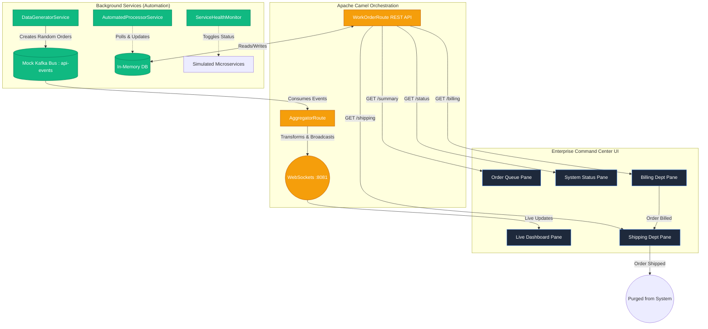

# Enterprise Command Center (formerly REST API Aggregator)

An Apache Camel-based Enterprise Command Center and REST API Aggregator. This system evolved from a basic API gateway into a fully automated, event-driven orchestration system with a responsive multi-pane dashboard.

## Overview

The Enterprise Command Center aggregates data from multiple simulated microservices into a unified "Mission Control" interface. It demonstrates Enterprise Integration Patterns (EIP)—specifically the **Pipes and Filters** pattern—and utilizes real-time WebSocket feeds and mock Kafka topics to create a live, interactive visualization of an enterprise workflow.

### Architecture Overview



## Key Features

- **Unified Command Center UI**: A dynamic, glassmorphism-styled 5-pane grid layout that consolidates live data dashboards, queuing systems, and departmental workflows into a single view using CSS Grid and an intelligent `iframe` architecture.
- **Automated Workflow Orchestration**: 
  - An internal message bus (simulated Kafka `api-events` topic) continuously drives data generation.
  - Automated processors autonomously advance orders through an enterprise pipeline: Intake -> Billing -> Shipping.
- **Real-Time Data Feeds**: Connects directly to the frontend via Camel Vert.x WebSockets (Port 8081) for instantaneous metric updates.
- **Chaos Engineering & Health Monitoring**: Includes a background `ServiceHealthMonitor` that randomly toggles the status of simulated services, visualizing potential outages and self-healing behaviors on a live status board.
- **Advanced Security & API Gateway**: Configured with permissive iframe architectures (`SAMEORIGIN`), and foundational structures for rate-limiting.

## Tech Stack

| Component        | Version | Use Case |
|------------------|---------|----------|
| Java             | 17      | Core language |
| Spring Boot      | 3.2.4   | Application framework, Scheduling, and REST controllers |
| Apache Camel     | 4.6.0   | Routing, Orchestration, EIP implementations |
| WebSockets       | —       | Camel Vert.x module for real-time frontend pushing |
| Frontend         | —       | Vanilla JS, CSS3 Variables, CSS Grid, `iframe` compositions |

## Prerequisites

- JDK 17+
- Maven 3.8+

## Building & Running

1. **Build the application:**
   ```bash
   mvn clean package -DskipTests
   ```

2. **Start the application:**
   ```bash
   mvn spring-boot:run
   ```

3. **Access the Command Center:**
   Open a browser and navigate to: `http://localhost:8080/`

You will immediately see the automated workflow generating orders, passing them from the Order Queue into Billing, fulfilling them via Shipping, and broadcasting the data traffic to the Live Dashboard—all while the System Status board continuously monitors the health of the underlying microservices.

## Project Structure (Key Components)

```text
src/main/java/com/camel/aggregator/
├── config/                           # Security and WebSocket Configuration
├── routes/                           # Camel Routes (AggregatorRoute, WorkOrderRoute)
├── service/                          # Business logic (WorkOrderService, DataGeneratorService, ServiceHealthMonitor)
├── model/                            # Domain objects (Order)
└── src/main/resources/static/        # Frontend UI Assets (index.html, css/styles.css)
```
