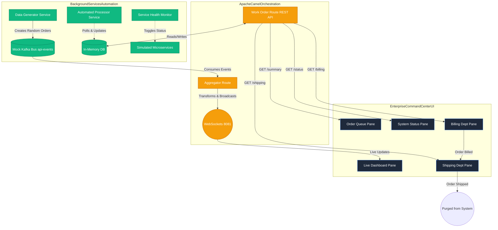

# Enterprise Command Center (formerly REST API Aggregator)

An Apache Camel-based Enterprise Command Center and REST API Aggregator. This system evolved from a basic API gateway into a fully automated, event-driven orchestration system with a responsive multi-pane dashboard.

## Overview

The Enterprise Command Center aggregates data from multiple simulated microservices into a unified "Mission Control" interface. It demonstrates Enterprise Integration Patterns (EIP)—specifically the **Pipes and Filters** pattern—and utilizes real-time WebSocket feeds and mock Kafka topics to create a live, interactive visualization of an enterprise workflow.

### Architecture Overview



## Key Features

- **Unified Command Center UI**: A dynamic, glassmorphism-styled 5-pane grid layout that consolidates live data dashboards, queuing systems, and departmental workflows into a single view using CSS Grid and an intelligent `iframe` architecture.
- **Automated Workflow Orchestration**: 
  - An internal message bus (simulated Kafka `api-events` topic) continuously drives data generation.
  - Automated processors autonomously advance orders through an enterprise pipeline: Intake -> Billing -> Shipping.
- **Real-Time Data Feeds**: Connects directly to the frontend via Camel Vert.x WebSockets (Port 8081) for instantaneous metric updates.
- **Chaos Engineering & Health Monitoring**: Includes a background `ServiceHealthMonitor` that randomly toggles the status of simulated services, visualizing potential outages and self-healing behaviors on a live status board.
- **Advanced Security & API Gateway**: Configured with permissive iframe architectures (`SAMEORIGIN`), and foundational structures for rate-limiting.

## Security & Architecture

This project implements a defense-in-depth security strategy. Key architectural decisions and security hardening steps are documented in our Architectural Decision Records (ADRs).

### Key Security Features
- **Secrets Management**: No hardcoded secrets; all credentials are injected via environment variables.
- **Data Persistence**: Production-ready PostgreSQL configuration with automated schema validation.
- **Security Headers**: Hardened with CSP, HSTS, and X-Content-Type-Options.
- **Infrastructure**: Containerized with a minimal, hardened JRE base image.

### Architectural Decision Records
- [0001-production-security-hardening.md](docs/adr/0001-production-security-hardening.md) - Transition to production-hardened infrastructure and security configuration.

## Tech Stack

| Component        | Version | Use Case |
|------------------|---------|----------|
| Java             | 21      | Core language |
| Spring Boot      | 3.4.13  | Application framework, Scheduling, and REST controllers |
| Apache Camel     | 4.6.0   | Routing, Orchestration, EIP implementations |
| WebSockets       | —       | Camel Vert.x module for real-time frontend pushing |
| Frontend         | —       | Vanilla JS, CSS3 Variables, CSS Grid, `iframe` compositions |

## Prerequisites

- JDK 21+
- Maven 3.9+

## Quick Start (Running the Pre-Built Release)

The easiest way to run the Enterprise Command Center is to download the automated semantic release. You do not need to compile the code.

1. **Download the Release**: Navigate to the [Releases](https://github.com/jsoehner/enterprise-command-center/releases) tab on this GitHub repository.
2. **Get the Executable**: Download the latest `.jar` file attached to the release assets.
3. **Run the Application**: Open your terminal in the download directory and execute:
   ```bash
   java -jar camel-aggregator-0.0.1-SNAPSHOT.jar
   ```
4. **Access the Dashboard**: Open your browser and navigate to `http://localhost:8080/`.

You will immediately see the automated workflow generating orders and passing them through the departments on the Live Dashboard.

## Building from Source (For Developers)

If you wish to modify the architecture or build the project manually:

1. **Build the application:**
   ```bash
   mvn clean package -DskipTests
   ```

2. **Start the application:**
   ```bash
   mvn spring-boot:run
   ```

## Project Structure (Key Components)

```text
src/main/java/com/camel/aggregator/
├── config/                           # Security and WebSocket Configuration
├── routes/                           # Camel Routes (AggregatorRoute, WorkOrderRoute)
├── service/                          # Business logic (WorkOrderService, DataGeneratorService, ServiceHealthMonitor)
├── model/                            # Domain objects (Order)
└── src/main/resources/static/        # Frontend UI Assets (index.html, css/styles.css)
```

## Gotchas & Lessons Learned

During the development and automation of this project, several important quirks and solutions were discovered:

- **GitHub Actions `env` Context Limitations**: The `env` context cannot be used in a `with:` or `name:` block of the *same* step, because those keys are evaluated before the step's environment variables are fully populated. For instance, when attempting a token fallback, `${{ secrets.MY_PAT || secrets.GITHUB_TOKEN }}` works perfectly, whereas attempting to use an intermediate `${{ env.TOKEN_VAR || github.token }}` defined in the same step will fail silently and incorrectly fall back.
- **GitHub Actions Node 24 Migration**: GitHub Actions has aggressively deprecated Node 20. Simply injecting a `setup-node` step does not fix third-party actions. You must bump the major version of the affected action itself (e.g., upgrading `actions/checkout` to `@v7` and `peter-evans/create-pull-request` to `@v7`).
- **Gitleaks Action Strict Inputs**: When upgrading to `gitleaks/gitleaks-action@v3`, you may encounter an `Unexpected input(s) 'args'` error due to new strict input validation. The solution is to remove the `args:` configuration entirely and let it run its default `detect` command.
- **QEMU Cache Locking**: When using Docker Buildx and QEMU, you might see `Unable to reserve cache with key...`. This is a benign race condition caused by concurrent jobs attempting to save the same cache key. It does not fail the build and can be safely ignored.
