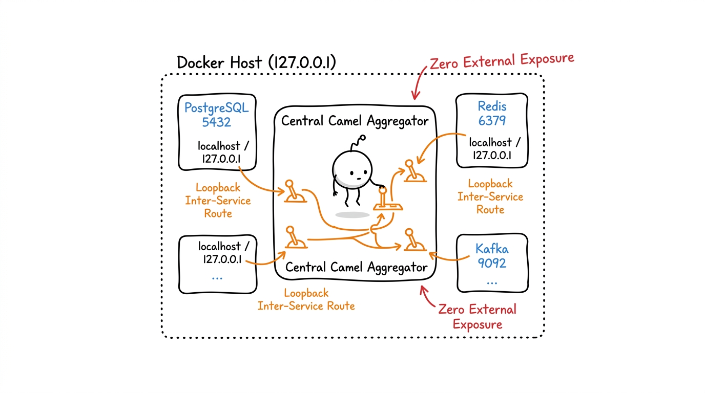

# REST API Aggregator (Enterprise Command Center)

A high-performance **Backend-for-Frontend (BFF)** and **REST API Aggregator** built with Apache Camel, Spring Boot, and a defense-in-depth security posture.

This project serves as a centralized gateway to aggregate multiple downstream microservices, providing a unified, resilient, and post-quantum-ready interface for enterprise applications.

## 🚀 Key Features

- **API Aggregation**: Orchestrates complex requests across multiple microservices using Apache Camel.
- **Resilience**: Implements circuit breakers and retries via Resilience4j.
- **Caching**: High-speed data retrieval using Caffeine and Redis.
- **Defense-in-Depth Security**: Hardened with CSP, HSTS, and X-Content-Type-Options headers.
- **Post-Quantum Security Strategy**: Architecture roadmap for NIST FIPS 203 ML-KEM key encapsulation and Merkle Tree Certificates (MTCs).
- **Scalability**: Production-ready with PostgreSQL for persistence and Kafka for event streaming.
- **Observability**: Integrated with Micrometer, Prometheus, and Zipkin for distributed tracing.

## 🛠 Tech Stack

| Component | Technology |
| --- | --- |
| **Framework** | Spring Boot 3.5.15 |
| **Integration** | Apache Camel 4.10.0 |
| **Database** | PostgreSQL & H2 (Dev) |
| **Cache** | Redis & Caffeine |
| **Messaging** | Apache Kafka |
| **Security** | Spring Security & Bouncy Castle PQC Strategy |
| **Build Tool** | Maven 3.9+ |
| **Language** | Java 21 |

## 📋 Prerequisites

Before running the application, ensure you have the following installed:
- JDK 21
- Maven 3.9+
- PostgreSQL instance
- Redis instance

## 🚀 Quick Start

1. **Clone the repository**:
   ```bash
   git clone https://github.com/jsoehner/enterprise-command-center.git
   cd enterprise-command-center
   ```

2. **Configure Environment**:
   Set environment variables or edit configuration files:
   - `ADMIN_USERNAME`
   - `ADMIN_PASSWORD`
   - `SPRING_DATASOURCE_URL` (PostgreSQL)
   - `SPRING_REDIS_HOST`

3. **Build and Run**:
   ```bash
   mvn clean package -DskipTests
## 🐫 Why Apache Camel?

We leverage **Apache Camel** as our core integration and routing framework for several key reasons:

1. **Enterprise Integration Patterns (EIP)**: Apache Camel natively supports declarative patterns (Splitter, Aggregator, Content-Based Router, Circuit Breaker) without custom boilerplate code.
2. **Protocol Decoupling**: Seamlessly translates between REST/HTTP, WebSockets, gRPC, and Kafka event streams via unified URI routes (`from(...)` -> `to(...)`).
3. **Resilience & Fallback Handling**: Integrates directly with Resilience4j for circuit breaking and fallback responses during downstream service degradation.

### 🌐 Docker Loopback Network Architecture

In production container environments, microservice components run within isolated Docker containers communicating via loopback (`127.0.0.1`) / inter-service routing. Apache Camel acts as the central router and aggregator, mediating internal network loops with zero unencrypted external exposure:



## 🛡 Security & Architecture

This project follows a **defense-in-depth** security strategy and strict dependency lifecycle governance.

### Dependency & Workflow Governance
To prevent runtime binary incompatibilities (such as `NoSuchMethodError` across Spring Boot and Apache Camel), automated dependency updates follow explicit pinning rules:
- `spring-boot-starter-parent` and `org.apache.camel.springboot` minor/major versions are pinned.
- Automated nightly workflows run build verification (`mvn clean verify`) with resilient error handling and default credential fallbacks for test automation.
- Dependabot enforcement uses a 7-day cooldown window (`.github/dependabot.yml`).

### Architectural Decision Records (ADRs)
Major architectural decisions are tracked in the [docs/adr/](docs/adr/) directory:
- **ADR 0001**: [Production Security Hardening](docs/adr/0001-production-security-hardening.md) - Transition to environment-variable secrets, PostgreSQL persistence, and security headers.
- **ADR 0002**: [Post-Quantum Cryptography (ML-KEM & Merkle Tree Certificates)](docs/adr/0002-post-quantum-crypto-ml-kem-merkle-trees.md) - Roadmap for hybrid ML-KEM-768 key exchange and Merkle Tree Certificates for handshake optimization.

## 🤝 Contributing

1. Fork the repository.
2. Create your feature branch (`git checkout -b feature/AmazingFeature`).
3. Commit your changes (`git commit -m 'feat: Add AmazingFeature'`).
4. Push to the branch (`git push origin feature/AmazingFeature`).
5. Open a Pull Request.

---
*Built with ❤️, Apache Camel, and Spring Boot.*

