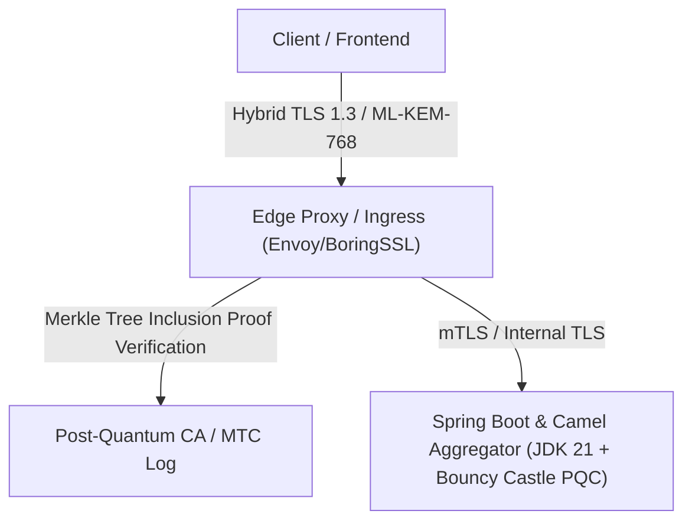

# ADR 0002: Roadmap and Strategy for Post-Quantum Cryptography (ML-KEM & Merkle Tree Certificates)

* **Status:** Superseded by [ADR-0010](0010-post-quantum-cryptography-ml-kem-implementation.md)
* **Deciders:** Enterprise Command Center Architecture & Security Team
* **Date:** 2026-08-21
* **Superseded by:** [ADR-0010](0010-post-quantum-cryptography-ml-kem-implementation.md)

> [!NOTE]
> This strategic roadmap ADR has been formally superseded by the active implementation documented in [ADR 0010: Post-Quantum Cryptography Implementation with Bouncy Castle ML-KEM-768](0010-post-quantum-cryptography-ml-kem-implementation.md).

---

## 1. Context & Business Problem Statement

As post-quantum cryptographic standards (NIST FIPS 203 ML-KEM, FIPS 204 ML-DSA) and draft RFC standards for compressed certificate chains (such as IETF Merkle Tree Certificates) mature, legacy public-key infrastructure (RSA/ECDSA and ECDH key exchange) poses long-term harvest-now-decrypt-later (HNDL) security risks for enterprise data streams.

The **Enterprise Command Center** relies on Spring Boot 3.5+, JDK 21+, Apache Camel 4.x, Netty, and TLS termination proxies (e.g., NGINX / Cloudflare / Envoy).

We need an explicit strategy and roadmap to incorporate **ML-KEM** for key encapsulation and **Merkle Tree Certificates** (MTCs) for lightweight, post-quantum certificate validation.

---

## 2. Decision Drivers

1. **Quantum Resilience**: Protect REST and WebSocket endpoints against quantum decryption risks (HNDL).
2. **Bandwidth and Performance**: Quantum-safe public keys and signatures (e.g. Dilithium/ML-DSA) significantly increase handshake size. **Merkle Tree Certificates (MTCs)** reduce handshake overhead by replacing traditional X.509 signature chains with compact Merkle inclusion proofs.
3. **Platform Toolchain Readiness**: JDK 21/25, Bouncy Castle PQC providers, and reverse-proxy ecosystem support (Envoy / OpenSSL 3.5 / BoringSSL).

---

## 3. Architecture & Implementation Plan

### Phase 1: Hybrid Key Exchange (ML-KEM-768 / X25519) at Edge Ingress
* **Edge Proxy Layer**: Terminate hybrid post-quantum TLS 1.3 key exchange (e.g., `X25519_MLKEM768`) at the reverse proxy (Envoy / NGINX with OpenSSL 3.5+ / BoringSSL).
* **Backend Isolation**: Keep internal Spring Boot / Camel HTTP & WebSocket traffic on TLS 1.3 with internal PKI while upgrading upstream edge nodes.

### Phase 2: Java Runtime & Security Provider Integration
* **Bouncy Castle PQC**: Add `bcprov-jdk18on` / `bcpkix-jdk18on` as a security provider in `SecurityConfig.java` to enable Java native parsing of ML-KEM keys.
* **SunJSSE / JSSE Provider**: Enable hybrid TLS key exchange groups in Spring Boot application properties (`server.ssl.ciphers` and `jdk.tls.namedGroups`).

### Phase 3: Merkle Tree Certificate (MTC) Adoption
* **Compact Certificate Chains**: Transition edge proxies and client trust stores to support Merkle Tree Certificates for high-throughput, low-latency TLS handshakes without standard large X.509 certificate chains.
* **Certificate Lifecycle Automation**: Integrate MTC validity logs into automated cert-manager and renewal workflows.

---

## 4. Consequences & Risks

### Positive
* **Future-Proof Security**: Complete mitigation against store-now-decrypt-later quantum attacks.
* **Reduced Handshake Size**: MTCs mitigate post-quantum signature expansion overhead.

### Trade-offs / Risks
* **Ecosystem Maturity**: MTC and ML-KEM standards in Java JSSE / Netty require careful testing against older HTTP/WebSocket clients.
* **Performance Impact**: CPU overhead during hybrid key encapsulation; offset by hardware acceleration or edge proxy offloading.

---

## 5. Next Steps & Checklist

- [ ] Prototype hybrid TLS (`X25519_MLKEM768`) termination in edge reverse proxy configuration.
- [ ] Evaluate Bouncy Castle 1.78+ PQC integration in Java 21 `SecurityConfig.java`.
- [ ] Benchmark WebSocket and REST API handshake latency with ML-KEM enabled.
- [ ] Monitor IETF Merkle Tree Certificate standardization and cert-manager plugin availability.
